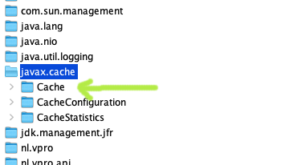

= Extra MBeans for jcache JSR-107

Some MBeans can easily be installed, but in previous version of ehcache we also had
the possibility to clear caches.

This restores it for ecache-3.

]

== How to install?

Adding the dependency should do it:

.pom.xml
[source,xml]
----
    <dependency>
      <groupId>nl.vpro.shared</groupId>
      <artifactId>vpro-shared-jcache</artifactId>
    </dependency>
----
