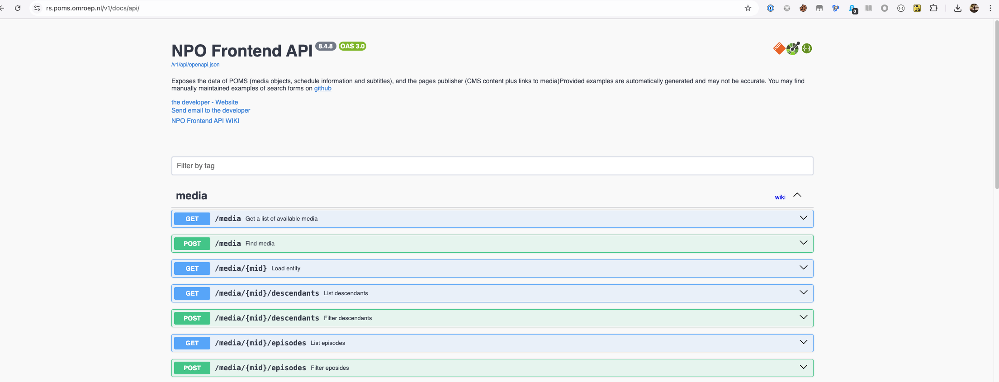

= Swagger3 taglib

This contains a small taglib for building the swagger-ui

== Usage

E.g. our index page is normally implemented something like so:
[source,xhtml]
----
<jsp:root
        xmlns:jsp="http://java.sun.com/JSP/Page"
        xmlns="http://www.w3.org/1999/xhtml"
        xmlns:swagger="https://www.vpro.nl/shared/tags/swagger"
        xmlns:npo="https://www.vpro.nl/shared/tags/npo"
        version="2.0">
  <jsp:directive.page contentType="text/html" pageEncoding="UTF-8" session="false" />
  <swagger:html
    title="Pages Publisher Swagger UI"
    deepLinking="true"
    filter="true"
    operationsSorter="alpha">
  >
    <jsp:attribute name="head">
      <npo:favicon />
    </jsp:attribute>
    <a href="https://wiki.vpro.nl/display/npoapi/Indexing">
      <npo:logo />
    </a>
  </swagger:html>
</jsp:root>

----

It will look e.g. like so:

The tags are completely implemented via link:src/main/resources/META-INF/tags/swagger[tag files], and are best documented by just looking at them.

